# Penguin Individual Re-Identification

**English** | [中文](README.zh-CN.md)

Given a photo of a **Humboldt penguin**, identify **which individual** it is — individual identity, not species. The intended use is non-invasive: a keeper or visitor photographs a bird and the system names it, or says it does not know. All individuals in this project are Humboldt penguins from a single colony.

The system turns each photograph into a vector, matches it against a vector database of enrolled individuals, and either returns an identity or refuses. A **data-leakage audit** ([§5](#5-data-leakage-audit--cross-session-evaluation)) found the original headline inflated by same-session camera bursts shared between train and test. Under session-wise cross-validation ([§6](#6-cross-validated-metric-learning)) identification reaches **macro rank-1 0.559** against **0.390** for the plain baseline; a full loss × augmentation design attributes most of that to **augmentation** rather than to metric learning, with ArcFace's contribution emerging as the gallery grows. Ranked against the whole 81-bird colony the figure is **0.477**, and once real strangers must be refused 99% of the time it is **0.123** — that last number, not the first, is what describes deployment readiness. All accuracies are **macro**: each individual weighted equally, regardless of how many photos it has.

### The whole arc in one table

| phase | what was done | evaluation protocol | headline |
|---|---|---|---|
| exp1 ([§2](#2-completed-experiments)) | ResNet18 softmax classifier, 44 individuals | random split | 0.950 per-image |
| exp2 ([§2](#2-completed-experiments)) | same, on belly crops | random split | 0.866 per-image |
| exp3 ([§2](#2-completed-experiments)) | frozen features + FAISS retrieval | random split | 0.959 per-image |
| **leakage audit** ([§5](#5-data-leakage-audit--cross-session-evaluation)) | *the same pipeline, re-split by capture session* | session-disjoint, macro | **0.389** |
| **metric learning** ([§6](#6-cross-validated-metric-learning)) | ArcFace + strong augmentation | session-wise 5-fold CV, macro | **0.559** |
| — attribution ([§6](#which-change-did-the-work)) | full loss × augmentation design | " | aug +0.141, ArcFace +0.096 |
| — colony scale ([§6](#6-cross-validated-metric-learning)) | ranked against all 81 members | " | **0.477** |
| — open set ([§6](#open-set-identification)) | real never-trained strangers, FAR = 1% | " | **0.123** |
| **deployment** ([§7](#7-the-system)) | all data, 81 enrolled, threshold 0.938 | not directly measurable | 0.559 is its conservative estimate |

The three per-image figures in the first rows are **not comparable** with the rest: they use a random split that leaks camera bursts between train and test, and they weight photos rather than individuals. They are kept because the gap between them and the honest figures is one of this project's results.

A machine-readable summary of every current number is regenerated into [`analysis/artifacts/RESULTS.md`](analysis/artifacts/RESULTS.md) by `analysis/summarise_results.py`.

### The two results that matter most

**1. Which change did the work.** All four cells of the loss × augmentation design, macro rank-1 over 35 individuals under session-wise 5-fold cross-validation:

| | basic augmentation | strong augmentation |
|---|---|---|
| softmax | 0.390 | 0.530 |
| **ArcFace** | 0.486 | **0.559** |

Augmentation alone is worth **+0.141** [+0.105, +0.179]; ArcFace alone **+0.096** [+0.061, +0.139]. They are sub-additive — the interaction is −0.068 — so the combined +0.169 is less than their sum. **Augmentation, not metric learning, is the larger single lever.** But once strong augmentation is present, ArcFace's remaining contribution is +0.029 [−0.005, +0.060] at 35 candidates — indistinguishable from zero — and **+0.116** [+0.082, +0.148] against all 81, because metric learning shapes the embedding geometry rather than the top-1 call. Full decomposition in [§6](#which-change-did-the-work).

**2. Accuracy is set by capture sessions, not photo count.** Same models, individuals grouped by how many separate occasions they were photographed on:

| capture sessions | individuals | ArcFace + strong |
|---|---|---|
| **3** | 8 | **0.186** |
| 4–6 | 13 | 0.618 |
| **7 or more** | 14 | **0.717** |

A bird photographed on seven separate occasions is identified almost **four times as often** as one photographed on three, and metric learning cannot close that gap — it lifts the 3-session group only from 0.081 to 0.186. Extra frames inside an existing burst add nothing; only a new occasion, on a different day and in different light, does. Excluding the eight 3-session birds, the remaining 27 reach **0.669**. This is the project's central finding and the reason the first future-work item is a camera rather than an algorithm.

---

## Table of Contents
- [1. Dataset](#1-dataset)
- [2. Completed Experiments](#2-completed-experiments)
- [3. Experiment Record Figures](#3-experiment-record-figures)
- [4. Key Findings](#4-key-findings)
- [5. Data Leakage Audit & Cross-Session Evaluation](#5-data-leakage-audit--cross-session-evaluation)
- [6. Cross-Validated Metric Learning](#6-cross-validated-metric-learning)
- [7. The System](#7-the-system)
- [8. Repo Structure](#8-repo-structure)
- [9. Reproduce](#9-reproduce)

---

## 1. Dataset

- Raw data `penguins_data/`: **81 individuals, 2307 photos**, image counts ranging from 1 to 291 per bird — a **severe long-tail imbalance**.
- Filtered to the **44 individuals with ≥ 16 images** (`penguin_image_count_summary.csv`, `selected=True`); the remaining 37 (≤15 images) are too sparse to train and are held out for now.
- Of those 44, **35 have ≥ 3 distinct capture sessions** and are the individuals used in every session-disjoint evaluation ([§5](#5-data-leakage-audit--cross-session-evaluation), [§6](#6-cross-validated-metric-learning)). A session is a burst of frames from one shoot, detected from filename prefix and frame numbering.
- Split per individual into train / val / test: `penguins_dataset_split/`.
- Belly-crop variant (produced by the belly detector): `penguins_dataset_split_belly_by_yoloV8/`.

> Even within the selected 44, counts run from 291 (Medici) down to ~16 — an ~18× max/min gap. This imbalance is the root cause of most downstream difficulty. See [Figure 05](#3-experiment-record-figures).
>
> **Coverage is the harder limit than accuracy:** 37 of the colony's 81 birds are not in the system at all, and cannot be identified at any accuracy until they are photographed.

## 2. Completed Experiments

The first phase of the project: classification, belly detection, and the retrieval experiment that set the current design. **Everything in this section predates the leakage audit**, so its numbers are per-image on a random split and are superseded by [§5](#5-data-leakage-audit--cross-session-evaluation) and [§6](#6-cross-validated-metric-learning). It is retained because the design decisions it produced still stand, and because the gap between these numbers and the honest ones is itself a result.

| Experiment | Input | Model | Epochs | best val acc | **test acc** |
|---|---|---|---|---|---|
| **exp1 baseline** | full body | ResNet18 (transfer) | 29 (early-stop, cap 30) | 0.907 | **0.950** |
| **exp2 belly** | belly crop | ResNet18 (transfer) | 39 (early-stop, cap 50) | 0.867 | 0.866 |
| **belly detector** | full body | YOLOv8s detection | 98 | mAP@50 ≈ 0.98 | mAP@50-95 ≈ 0.60 |
| **exp3 embedding retrieval** | full body | ResNet18 features + FAISS (no training) | — | — | **0.959** (prototype) / 0.947 (1-NN) / 0.978 (top-5) |

> ⚠️ **Leakage caveat:** the exp1 (0.950) and exp3 (0.959) accuracies above use a **random split** and are **per-image**. A later audit found same-session camera bursts leak into the test set, inflating these numbers. Under a session-disjoint split the same pipeline scores **macro top-1 0.389** ([§5](#5-data-leakage-audit--cross-session-evaluation)); with ArcFace metric learning and 5-fold cross-validation it reaches **0.559** ([§6](#6-cross-validated-metric-learning)). Treat this section as a historical record, not as current performance.

Shared pipeline:
- `torchvision.datasets.ImageFolder` loading
- Transfer learning (ImageNet-pretrained ResNet18)
- Imbalance handling: `WeightedRandomSampler` + class-weighted `CrossEntropyLoss`
- Best checkpoint by val accuracy; final test evaluation with prediction CSV export

**exp1 (full body)** — test accuracy **0.950**, best val 0.907 (epoch 21). Per-class results ([Figure 04](#3-experiment-record-figures)) show high-support individuals (Cooper n=20, Ron_burgundy n=29, Medici n=44) near-perfect; errors concentrate on classes with only 3–5 test samples.

**exp2 (belly crop)** — test accuracy **0.866**, clearly **below** the full-body 0.950. Its val loss stays consistently higher ([Figure 01](#3-experiment-record-figures), right) — worse generalization.

**belly detector (YOLOv8s)** — 98 epochs, val **mAP@50 ≈ 0.98 / mAP@50-95 ≈ 0.60**, precision/recall ~0.95 ([Figure 03](#3-experiment-record-figures)). Weights: `runs/detect/runs/belly_detector/exp1/weights/best.pt`. Detection is good, but cropping **discards identity cues** (face, chest band, body proportions) and detector errors propagate downstream — which explains why exp2 is worse.

**exp3 (embedding retrieval — the origin of the current design)** — reuse the exp1 ResNet18 as a **frozen 512-d feature extractor** (drop the classification head), enroll all train+val images into a **FAISS** vector store, and identify test photos by nearest-neighbor / class-prototype search. **No new training.** Result: prototype (class-mean) top-1 **0.959**, 1-NN top-1 0.947, top-5 0.978 — i.e. retrieval **matches/slightly beats** the softmax classifier (0.950) while giving an enrollable vector DB (new individuals just get added, no retraining). Code: `embedding_id/`. This established the retrieval design the project now uses ([§7](#7-the-system)).

## 3. Experiment Record Figures

Figures 01–05 cover the classification experiments and are regenerated from each run's logs by `plot_experiments.py`. Figures **06–12** cover the leakage audit and the cross-validated evaluation; they are regenerated from the JSON artifacts by `analysis/plot_figures.py` and appear inline in [§5](#5-data-leakage-audit--cross-session-evaluation) and [§6](#6-cross-validated-metric-learning). Both scripts write to `figures/`.

**Fig 01 — Classifier training curves (full body vs belly)**
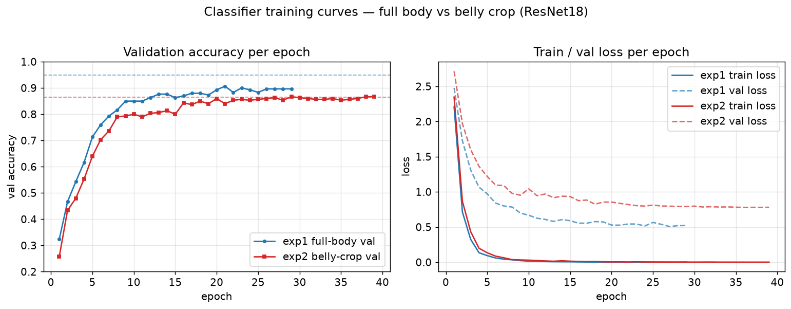

**Fig 02 — Final 44-class test accuracy**
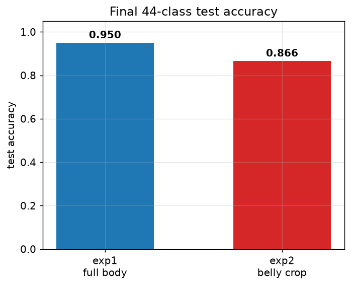

**Fig 03 — Belly detector (YOLOv8s) validation metrics**
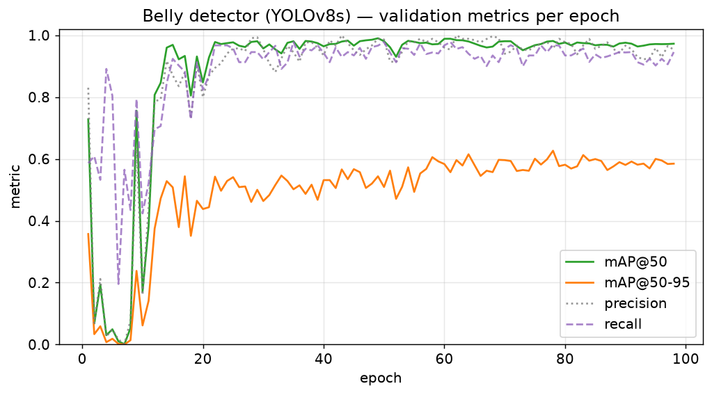

**Fig 04 — exp1 per-class test accuracy (sorted; n = support samples)**
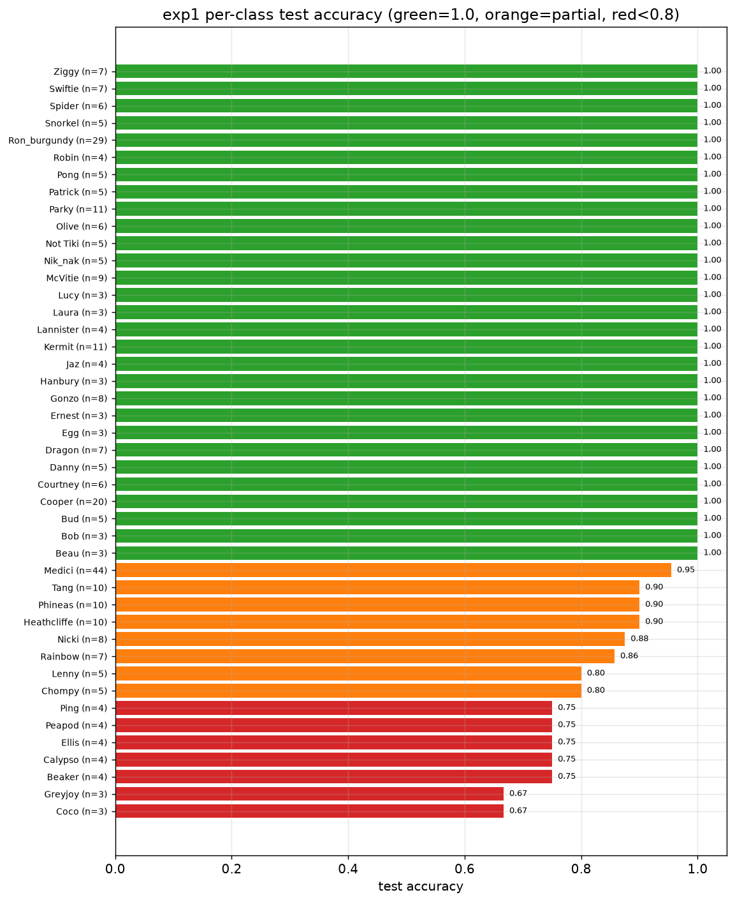

**Fig 05 — Per-individual image counts (blue = selected/trainable, grey = dropped)**
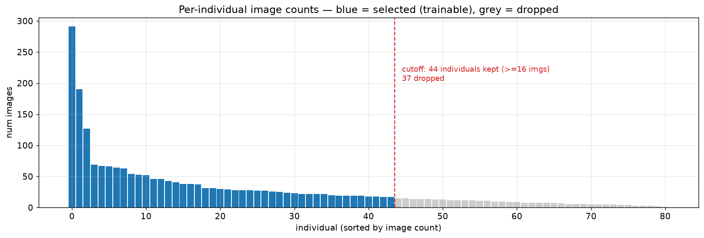

## 4. Key Findings

1. **Full body > belly crop (0.950 vs 0.866, random split).** Identity signal is not only in the belly — face pattern, chest band, and body proportions all carry information. Cropping too tightly discards it, and detector error adds noise.
2. **Training/collection standard = full-body frontal photos.** No need to force a clean, complete belly.
3. **Front only.** A penguin's back is a large, uniform dark region, nearly identical across individuals; mixing front+back inflates intra-class variance. A production system should ask the visitor to re-shoot "non-frontal" photos rather than force an identity.
4. **Data is the binding constraint — in two distinct ways.**
   - **Coverage.** Only 44 of the colony's 81 individuals have enough photos to train on, and 35 have enough capture sessions to evaluate. The other 37 are absent from the system entirely; no algorithm addresses that.
   - **Session diversity.** Among the 35, accuracy tracks *capture sessions per bird* rather than photo count: 0.19 for birds with 3 sessions versus 0.72 for birds with 7+ ([§6](#6-cross-validated-metric-learning)). Extra frames from the same burst do not help; photographs on a new day, in new light, do.
   
   The model side is nevertheless **not exhausted**: on birds that already have ≥4 sessions, moving from softmax+basic to ArcFace+strong lifted accuracy from 0.481 to 0.669. The full loss × augmentation design ([§6](#6-cross-validated-metric-learning)) attributes the larger share of that to **augmentation** (+0.141) rather than to the metric-learning loss (+0.096). Data and method are complementary levers, not alternatives.

## 5. Data Leakage Audit & Cross-Session Evaluation

The dataset contains many **burst sequences** — same camera, same moment, consecutive frames (e.g. `DSC_2743…2749`). Because `a.py` splits each individual's photos **at random**, near-duplicate frames from one burst can land in train and test at the same time; the model is then scored on photos it has effectively already seen, inflating accuracy.

**Audit** (`analysis/leakage_audit.py`) — using signals independent of the model (perceptual hash, pixel correlation, EXIF capture time, filename frame numbers):
- **13.8%** of test images have a near-duplicate in the train+val gallery;
- **97.8%** share a capture **session** with a gallery image;
- of images with EXIF, ~29% are within 1 second of their nearest train image.

**Honest re-evaluation.** We re-split by whole **session** (no burst spans train and test) and **retrain from scratch**, against a **random-split control on the same 35 birds / 1743 images / identical per-bird counts** — so any gap is due to the split alone, not to less data. The session-disjoint test set has **0%** near-duplicates vs **10%** for the control.

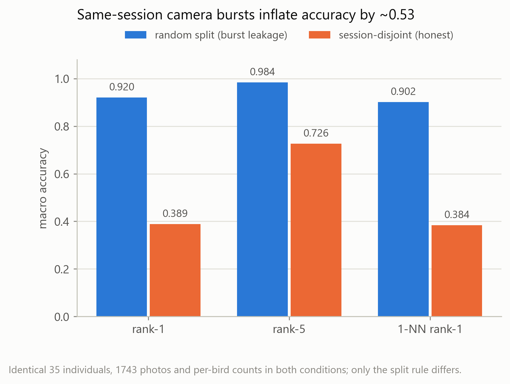

All figures below are **macro** (each individual weighted equally), computed by `analysis/evaluate.py`:

| macro metric | random split (leaky) | session-disjoint (honest) | gap |
|---|---|---|---|
| retrieval prototype top-1 | 0.920 | **0.389** | +0.531 |
| retrieval prototype top-5 | 0.984 | **0.726** | +0.258 |
| retrieval 1-NN top-1 | 0.902 | **0.384** | +0.518 |

The control **reproduces the ~0.92 headline**, so the drop is cleanly attributable to the split. The softmax classification head collapsed in exactly the same way; it is not tabulated here because the identification interface is retrieval, and the head's accuracy exists only per-image. The discriminative power lived in a feature extractor that had seen every session — the earlier 0.95/0.959 mainly measured *same-session* recognition and overstated *cross-session* (different day / lighting) generalization.

> **Two evaluation choices worth stating.** (1) *Macro, not micro.* The test set is dominated by a few heavily photographed birds (Medici 291 photos, Beau 19); per-image accuracy silently adopts that as a prior over which penguin gets photographed, which nothing justifies. (2) *Prototype top-5 means the five nearest class prototypes*, i.e. five distinct candidate individuals — not the five nearest gallery photos, which can all belong to the same bird and so overstate how much a shortlist helps a keeper.

**Open-set threshold** (`embedding_id/tune_openset.py`) — the identifier must also answer "I don't know this bird". Simulating unknowns by leave-one-penguin-out, known vs unknown separability measured **AUC 0.991**, and the confidence threshold was raised **0.55 → 0.80**, reported at the time as rejecting 96.6% of unenrolled birds.

> ⚠️ **That figure was later shown to be wrong.** The leave-one-penguin-out simulation is far too easy: the "unknown" bird was in the training set and had been pushed away from every other identity. Measured against birds the model genuinely never trained on ([§6](#6-cross-validated-metric-learning)), a threshold of 0.80 **accepts 29.7% of real strangers**. The shipped value is now **0.938**. This paragraph is retained as the historical record of how the error arose.

**Implication.** Cross-session generalization — not same-session accuracy — is the real challenge, and it is data-limited: 10 of the 44 enrolled birds have only one or two photo sessions. This motivated the two levers pursued in [§6](#6-cross-validated-metric-learning): **ArcFace metric learning** and **more multi-session photos per individual**.

**Known limitation of this single split.** Whole sessions are assigned to train/val/test, so per-bird test size is whatever a session happens to contain — from **1 photo (Beau, Spider, Not Tiki) to 43 (Medici)**, i.e. an actual test share ranging from 2.7% to 42% against a nominal 15% target. Statistics for the smallest birds are near-meaningless here; [§6](#6-cross-validated-metric-learning) removes this limitation by cross-validating.

Scripts: `analysis/leakage_audit.py`, `analysis/build_session_splits.py`, `analysis/session_disjoint_eval.py`, `analysis/evaluate.py`, `embedding_id/tune_openset.py`.

## 6. Cross-Validated Metric Learning

§5 gives an honest but fragile estimate: with whole sessions assigned to one split, several individuals are judged on one or two photographs. This section replaces that single draw with cross-validation and uses it to measure metric learning.

**Protocol** — pre-registered before any run, identical for every configuration compared.

- **Session-wise 5-fold CV** (`analysis/build_cv_folds.py`). *Sessions*, never individual photos, are dealt into folds. Each session goes to the fold minimising (that bird's images already there, then all birds' images already there); the second key matters, because balancing per bird alone piles every bird's largest session into fold 0 and leaves it training on 59% of the data instead of 80%. Result: all five folds get **~80% train / ~350 test**.
- **Every one of the 1743 photos is tested exactly once**, by a model that never saw its capture session — against 261 tested photos under a single split. A bird such as Beau is judged on all 19 of its photos rather than 1.
- **Fixed 80-epoch cosine schedule, no validation split, no early stopping**, final epoch kept (`train_metric.py`). This keeps training data at 80% and removes checkpoint selection as a bias source.
- Configurations are compared by a **paired bootstrap** on the macro difference — the same resampled images applied to both — which is considerably more sensitive than asking whether two independent confidence intervals overlap.

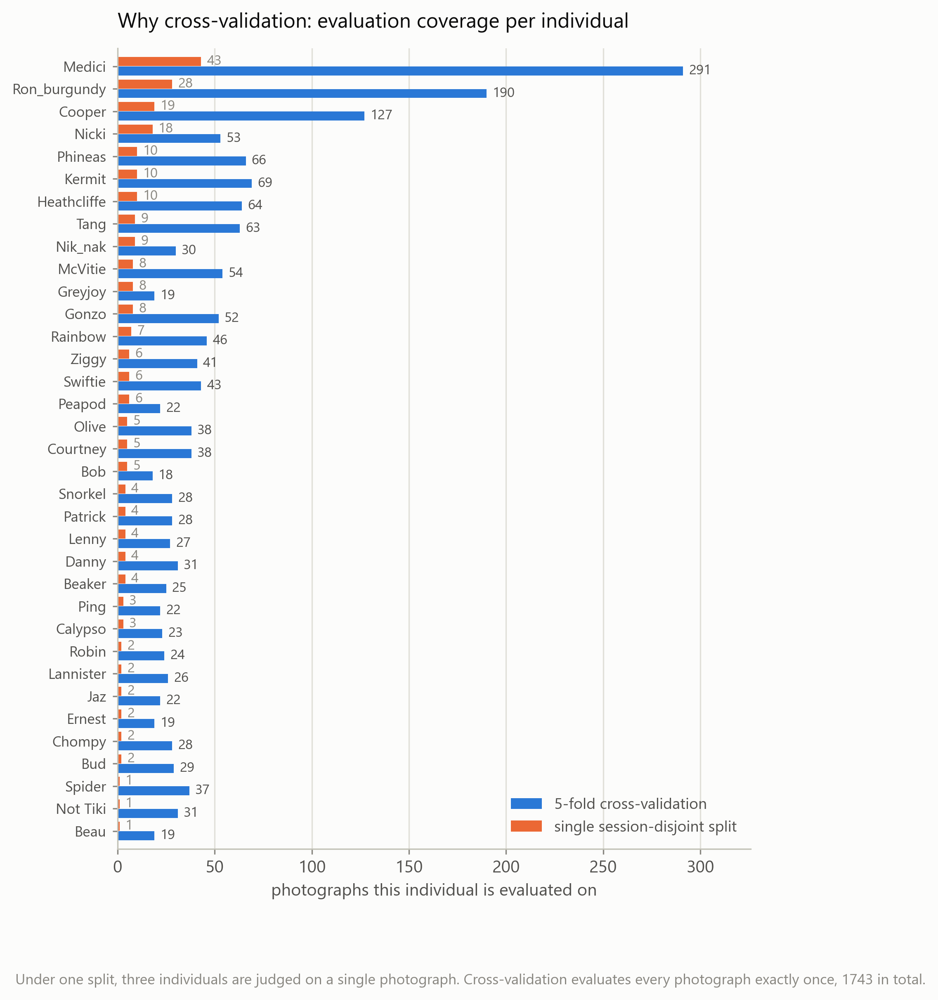

**Result** (`analysis/eval_cv.py`, macro, 1743 photos). All four cells of the loss × augmentation design were run, so each change can be attributed rather than confounded. Intervals are 95% **session-clustered** bootstraps — photos inside one burst are near-duplicates, so resampling photos would treat correlated samples as independent and report an interval that is too narrow.

| configuration | rank-1 (35-way) | rank-5 | mAP | rank-1 (81-way, colony) |
|---|---|---|---|---|
| softmax + basic | 0.390 [0.359, 0.434] | 0.746 [0.709, 0.787] | 0.420 [0.394, 0.463] | 0.224 [0.194, 0.262] |
| softmax + strong | 0.530 [0.490, 0.585] | **0.809** [0.775, 0.842] | 0.533 [0.501, 0.585] | 0.361 [0.322, 0.410] |
| ArcFace + basic | 0.486 [0.447, 0.543] | 0.734 [0.706, 0.784] | 0.509 [0.475, 0.563] | 0.364 [0.332, 0.404] |
| **ArcFace + strong** | **0.559** [0.517, 0.610] | 0.782 [0.751, 0.823] | **0.581** [0.543, 0.636] | **0.477** [0.436, 0.524] |

The baseline's cross-validated **0.390 reproduces the single-split 0.389** of §5, so cross-validation introduces no bias and the gains are measured against a verified baseline.

### Which change did the work

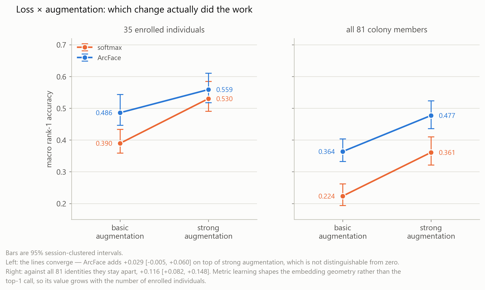

Paired bootstraps on each main effect:

| effect | rank-1 (35-way) | rank-1 (81-way) | mAP |
|---|---|---|---|
| **augmentation alone** (softmax+basic → softmax+strong) | **+0.141** [+0.105, +0.179] | +0.137 [+0.103, +0.174] | +0.113 [+0.087, +0.141] |
| **ArcFace alone** (softmax+basic → ArcFace+basic) | +0.096 [+0.061, +0.139] | +0.140 [+0.110, +0.173] | +0.088 [+0.057, +0.124] |
| **ArcFace on top of strong aug** (softmax+strong → ArcFace+strong) | +0.029 **[−0.005, +0.060]** | +0.116 [+0.082, +0.148] | +0.048 [+0.019, +0.072] |

Three things follow, and the third is the interesting one.

1. **Augmentation is the larger single lever** (+0.141 against ArcFace's +0.096), and it is significant on every metric. The combined effect of +0.169 is **sub-additive**: the two individual effects sum to +0.237, so the interaction is −0.068. They are partly treating the same problem.
2. **Each is independently effective.** Applied to the plain baseline, both intervals exclude zero.
3. **ArcFace's *marginal* value depends on how hard the task is.** Once strong augmentation is present, ArcFace adds **+0.029 [−0.005, +0.060]** on 35-way rank-1 — *not distinguishable from zero*. On the same models, ranked against all 81 colony members, it adds **+0.116 [+0.082, +0.148]**, and on mAP **+0.048 [+0.019, +0.072]**. Metric learning is shaping the global geometry of the embedding rather than the top-1 decision over a small candidate set, so its contribution becomes visible exactly as the gallery grows — which is the regime the method was designed for, and the regime a real colony is in.

An earlier single-split reading suggested the loss carried about two thirds of the gain. That reading was wrong: under the single split several individuals were judged on one or two photographs, and the cross-validated 2 × 2 reverses the ordering.

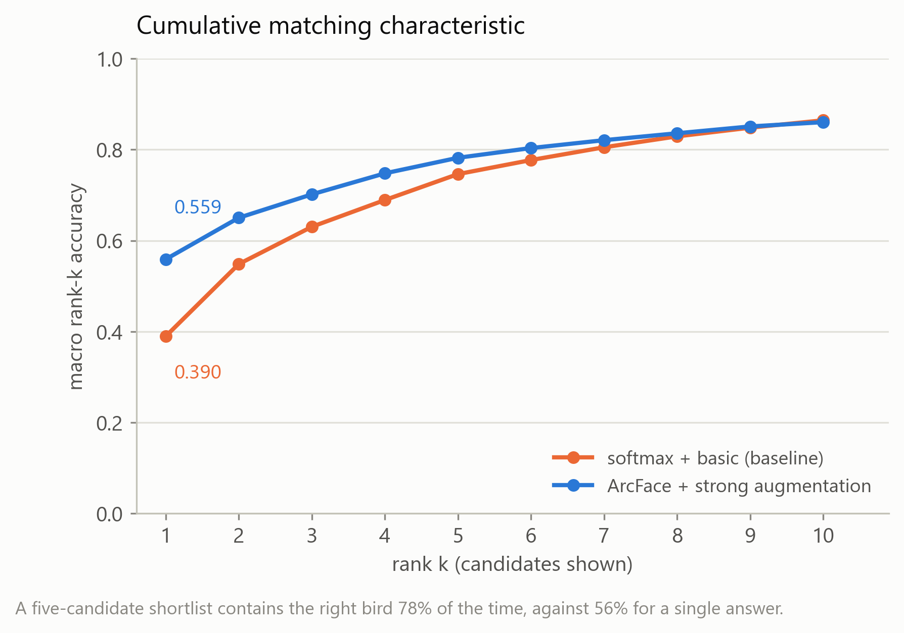

mAP rises with rank-1 rather than lagging it, so the gain is a genuinely better ranking and not a lucky first place. The CMC curve is also what justifies a shortlist interface: showing a keeper five candidates contains the right bird **78%** of the time against **56%** for a single answer.

**Accuracy is governed by capture sessions per individual, not by photo count:**

| capture sessions | individuals | softmax + basic | ArcFace + strong |
|---|---|---|---|
| 3 | 8 | 0.081 | **0.186** |
| 4–6 | 13 | 0.423 | **0.618** |
| 7+ | 14 | 0.535 | **0.717** |

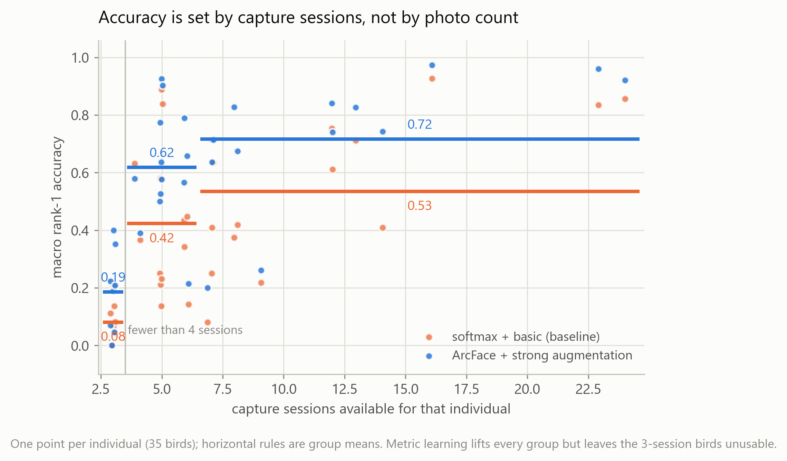

Metric learning lifts every bucket, but **cannot rescue the 3-session birds**: they stay unusable at 0.186, and one individual (Greyjoy) is never identified under either configuration. Excluding those 8, the remaining 27 individuals reach **0.669**. The levers are therefore complementary — ArcFace exploits session diversity that already exists, and only re-photographing creates it.

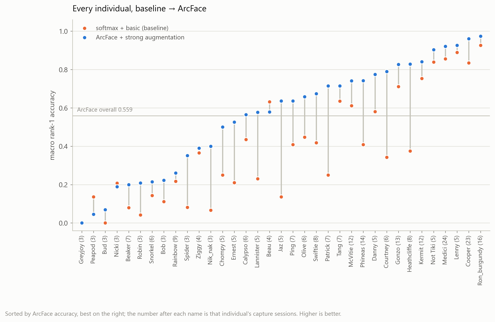

> **Correction to an earlier reading.** "12 of 35 individuals are never correctly identified" was an artifact of one- and two-photo test sets under the single split. Evaluated over every photo, the baseline has 2 such individuals and ArcFace has 1.

### Open-set identification

Rank-1 assumes the bird in front of the camera is already enrolled. In use the identifier is asked about strangers constantly, and it must refuse them rather than pick the nearest name.

**The impostors here are real.** The 564 photographs of the 46 colony members that never entered any fold are used as the stranger set — birds the models genuinely never trained on. An earlier version simulated an unknown by hiding a query's own prototype and taking its runner-up; that is far too easy, because the bird *was* in the training set and had been pushed away from every other identity. The simulation overstates performance by a large margin, and both numbers are reported below so the size of that bias is visible.

| operating point | softmax + basic | **ArcFace + strong** | what the simulation claimed |
|---|---|---|---|
| DIR @ FAR = 1% | 0.076 | **0.123** | 0.230 |
| DIR @ FAR = 5% | 0.134 | **0.237** | 0.361 |
| DIR @ FAR = 10% | 0.163 | **0.312** | 0.432 |

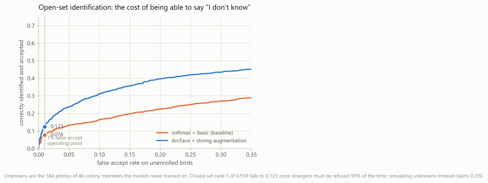

DIR@FAR=x is the fraction of enrolled birds both correctly named *and* confident enough to be accepted, at the threshold where strangers are wrongly accepted x of the time. **Closed-set rank-1 of 0.559 falls to 0.123** once real strangers must be refused 99% of the time. That gap — not the closed-set figure — is what describes deployment readiness, and it says the system is not yet dependable when it must also decline. ArcFace roughly doubles DIR at every operating point, so metric learning improves the confidence ordering and not only the ranking.

### The deployed model

Cross validation produces a performance *estimate*; it does not produce a shippable model. The deployed extractor is therefore retrained with the identical recipe on **every colony member and every photograph** (79 individuals, 2304 photos, no held-out set — `train_metric.py --deploy`), and the gallery enrols **all 81 individuals, 2307 photos** (`embedding_id/build_gallery.py`).

Two deliberate asymmetries, both of which follow from retrieval rather than classification:

- **Enrolment does not require session diversity; honest *evaluation* does.** A bird absent from the gallery can never be identified, only refused, so individuals too sparse to evaluate are still enrolled. Two of them were too sparse even to train on and are enrolled purely as stored vectors — which is the property that motivated the retrieval design: adding an individual is an enrolment, not a retraining.
- **Nothing is held out.** Withholding data now would only weaken the shipped model, and the estimate already exists.

The confidence threshold is **0.938**, measured at FAR = 5% on the cross-validated models against real strangers. The previous value of 0.80 was tuned on the leaky split against simulated unknowns and was documented as rejecting 96.6% of unenrolled birds; measured properly it **accepts 29.7%** of them. Two limits must be stated whenever the threshold is quoted: it is *transferred* from the cross-validated models, because the deployed model trains on every colony member and so has no genuine in-colony stranger left to calibrate against; and once all 81 are enrolled the realistic "unknown" is no longer an unenrolled bird but a bad photograph — blurred, rear-facing, or not a penguin — a case this threshold has never been calibrated for.

## 7. The System

The deliverable is an **individual identification system**, not a classifier. A photograph goes in, an individual comes out — or an honest refusal.

```
Photograph
   │
   ▼
[Frontal, full-body?]  ── rear view / not a penguin ──▶  "please re-shoot"
   │
   ▼
[ResNet18 embedding]     ArcFace-trained, 512-d, L2-normalised
   │  photo → vector
   ▼
[Vector store: 81 enrolled individuals]     FAISS, cosine over class prototypes
   │  ranked candidates
   ▼
[Open-set threshold 0.938]  ── best score too low ──▶  "not a bird I know"
   │
   ▼
Identity + ranked alternatives
```

Every stage above is built and measured. `embedding_id/identify.py` runs the whole path on one photograph and returns the decision, the ranked candidates, and the nearest reference photographs.

### Why retrieval rather than classification

The obvious design is a 81-way classifier. Retrieval was chosen for two properties a softmax head does not have, and both now show up in the deployed system:

- **Enrolment without retraining.** Adding an individual means storing its vectors. Two members of the colony have too few photographs to have trained on at all, yet they are enrolled and searchable. A classifier would need a new output layer and a full retrain for each arrival.
- **A natural way to say "I don't know."** Cosine similarity to a prototype is a calibrated-ish score with a threshold; a softmax head is forced to distribute probability over the identities it knows, so it names *something* no matter what walks past the camera. §6 shows how much this matters: at the operating point where real strangers are refused 99% of the time, only 0.123 of enrolled birds are still confidently named — the classifier route has no equivalent mechanism at all.

The classification experiments in §2 are retained as the baseline that motivated this design, and the softmax arm of §6 is retained as the control the metric-learning arm is measured against.

### What is not built

The system identifies individuals. It does **not** yet do anything with that identity — there is no per-individual record store, no interface, and no natural-language layer. An earlier plan for a retrieval-augmented conversational assistant has been **dropped**: the identification problem turned out to have enough depth to occupy the project on its own, and the honest open-set figure says the recognition layer is not yet dependable enough to build a visitor-facing product on top of.

### Current status

**Working and measured** — a session-disjoint cross-validated evaluation protocol (§6); a metric-learning extractor at macro rank-1 **0.559** over 35 individuals and **0.477** against the full colony; mAP, CMC and open-set DIR@FAR; a deployed extractor trained on all data, a gallery of all 81 individuals, and a threshold measured against real strangers.

**Next, in order of expected value**

1. **Photograph the under-covered birds.** The single lever that can move accuracy past the method ceiling, and the only one a camera can pull. Two distinct gaps: **43 of 81 individuals have fewer than two capture sessions** and so cannot even be evaluated honestly, and **8 enrolled birds have only 3 sessions** and sit at 0.186. Reaching four sessions for every colony member needs roughly 116 individual captures — about **eight separate shooting days** if a session covers ~15 birds. They must be *different days*: extra frames from an existing burst add nothing, which is the central finding of §5 and §6.
2. **Multi-photograph queries.** Averaging the embeddings of 3–5 photographs from one visit lifts per-visit accuracy from 0.652 to **0.734**, and to **0.772** for a whole visit. It costs nothing, needs no retraining, and matches how a keeper actually uses a camera. Measured, not projected.
3. **An end-to-end test set.** Every number in this document is measured on hand-cropped, well-framed photographs in which the bird occupies ~89% of the frame. A photograph taken casually is a different distribution, and the detector was itself trained on already-cropped images. Closing this needs a detect→crop→identify pipeline and a set of raw, uncropped photographs with known identities — currently the only part of the system with no measurement at all.
4. **Evaluation-side refinements.** Roughly +0.05 of macro rank-1 has been measured and left on the table: train/eval framing normalisation, multi-scale averaging, gallery whitening and cohort score normalisation. They change no conclusion in this document, which is why they are last.

## 8. Repo Structure

```text
pgs/
├─ README.md / README.zh-CN.md       # bilingual docs
├─ plot_experiments.py               # regenerates figures/ from run logs
├─ figures/                          # experiment record figures (PNG)
├─ penguin_image_count_summary.csv   # per-individual counts & selection
├─ make_doc.py                       # generates the photo-collection .docx
│
├─ a.py                              # per-individual train/val/test split
├─ train_experiment1.py              # classifier training (exp1/exp2, and the §5 retrains)
├─ train_metric.py                   # §6 softmax/ArcFace training under K-fold CV
├─ eval_checkpoint.py                # checkpoint evaluation
├─ crop_penguin_belly_yolo.py        # crop bellies with YOLO
├─ prepare_belly_yolo_dataset.py     # prepare belly-detection dataset
├─ train_belly_detector.py           # train belly detector
├─ annotate_belly.py                 # belly annotation tool
│
├─ embedding_id/                     # the deployed system
│  ├─ embedder.py                    #   photo -> 512-d vector; loads softmax or ArcFace checkpoints
│  ├─ build_gallery.py               #   enrols all 81 colony members for deployment
│  ├─ build_and_eval.py              #   the original exp3 retrieval experiment (§2)
│  ├─ identify.py                    #   one photo -> identity, candidates, or refusal
│  └─ tune_openset.py                #   threshold sweep
├─ analysis/                         # evaluation & audits
│  ├─ leakage_audit.py               #   §5 burst/session leakage audit
│  ├─ build_session_splits.py        #   §5 session-disjoint + random-control splits
│  ├─ session_disjoint_eval.py       #   §5 session clustering + re-evaluation
│  ├─ evaluate.py                    #   canonical macro-only evaluation of one model
│  ├─ build_cv_folds.py              #   §6 session-wise K-fold folds
│  ├─ eval_cv.py                     #   §6 fold aggregation, mAP/CMC/open-set, paired bootstrap
│  ├─ plot_figures.py                #   regenerates figures 06-12 from the artifacts
│  ├─ summarise_results.py           #   compiles artifacts/RESULTS.md, the results summary
│  └─ artifacts/                     #   JSON/CSV results for every analysis above
│
├─ penguins_data/                    # raw data
├─ penguins_dataset_split/           # full-body train/val/test (exp1)
├─ penguins_dataset_split_belly_by_yoloV8/  # belly-crop split (exp2)
│
└─ runs/
   ├─ exp1_baseline/                 # full-body classification results
   ├─ exp2_belly_resnet18/           # belly-crop classification results
   ├─ exp1b_session_disjoint/        # §5 honest cross-session retrain
   ├─ exp1b_random_control/          # §5 random-split control
   ├─ cv_softmax_basic/fold0..4/     # §6 the four cells of the loss x augmentation
   ├─ cv_softmax_strong/fold0..4/    #    design (weights gitignored, curves tracked)
   ├─ cv_arcface_basic/fold0..4/
   ├─ cv_arcface_strong/fold0..4/
   ├─ deploy_arcface/                # §6 the shipped model: all data, no held-out set
   └─ detect/…/belly_detector/exp1/  # belly detector results
```

## 9. Reproduce

Install dependencies (CUDA PyTorch for an RTX 4060):
```powershell
pip install torch torchvision --index-url https://download.pytorch.org/whl/cu121
pip install numpy pillow ultralytics matplotlib python-docx
```

Train classifiers:
```powershell
# exp1: full body
python train_experiment1.py --data-dir penguins_dataset_split --epochs 30 --batch-size 32
# exp2: belly crop
python train_experiment1.py --data-dir penguins_dataset_split_belly_by_yoloV8 --epochs 50 --batch-size 32
```

Data-leakage audit & honest cross-session evaluation (§5):
```powershell
# quantify burst/session leakage in the current split
python analysis/leakage_audit.py
# build session-disjoint + random-control splits, then retrain and compare
python analysis/build_session_splits.py
python train_experiment1.py --data-dir penguins_dataset_split_session_disjoint --output-dir runs/exp1b_session_disjoint
python train_experiment1.py --data-dir penguins_dataset_split_session_random  --output-dir runs/exp1b_random_control
# macro evaluation of both retrains
python analysis/evaluate.py
# tune the open-set rejection threshold (leave-one-penguin-out)
python embedding_id/tune_openset.py
```

Cross-validated metric learning (§6) — about 11 min per fold on an RTX 4060, ~1 h 50 m in total:
```powershell
# deal capture sessions into 5 balanced folds (writes analysis/artifacts/cv_folds.json)
python analysis/build_cv_folds.py
# baseline and ArcFace, 5 folds each, fixed 80 epochs, no early stopping
python train_metric.py --loss softmax --aug basic  --all-folds
python train_metric.py --loss arcface --aug strong --all-folds
# the other two cells of the design
python train_metric.py --loss softmax --aug strong --all-folds
python train_metric.py --loss arcface --aug basic  --all-folds
# pool folds; macro rank-1/rank-5/mAP/CMC/open-set, all four cells
python analysis/eval_cv.py cv_softmax_basic cv_softmax_strong cv_arcface_basic cv_arcface_strong
# each main effect on its own (a paired test needs exactly two arms)
python analysis/eval_cv.py cv_softmax_strong cv_arcface_strong --out analysis/artifacts/cv_pair_loss_given_strong.json
# redraw figures 06-12 from the JSON artifacts
python analysis/plot_figures.py
```

Train and enrol the deployed system (~20 min):
```powershell
python train_metric.py --loss arcface --aug strong --deploy
python embedding_id/build_gallery.py
python embedding_id/identify.py path/to/photo.jpg
```

Regenerate figures / photo list:
```powershell
python plot_experiments.py
python make_doc.py
```
