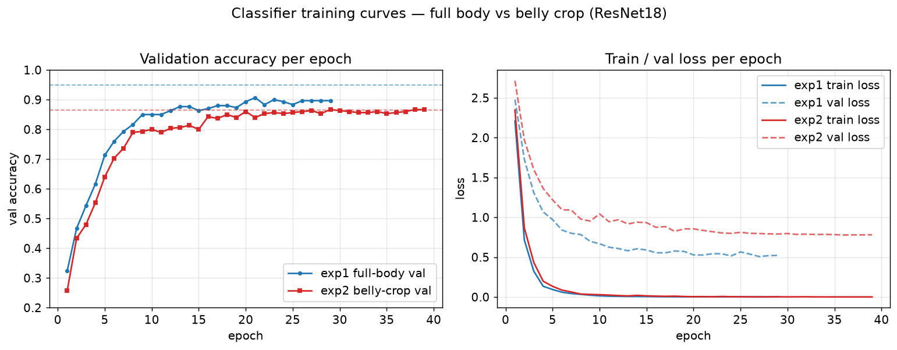
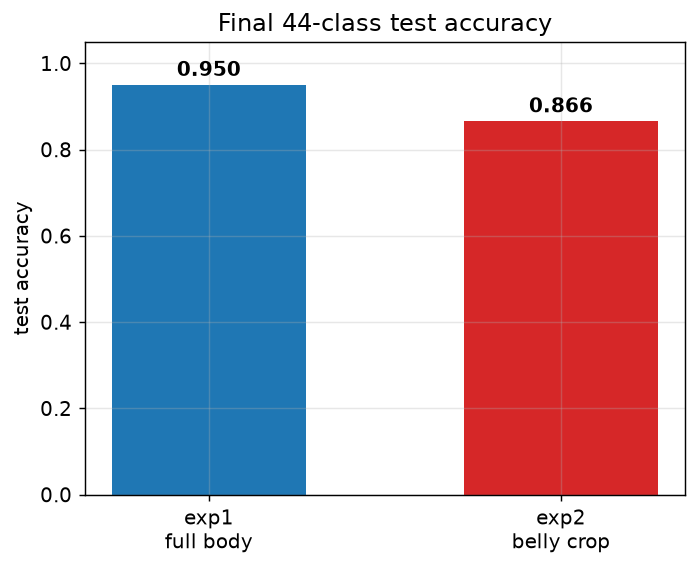
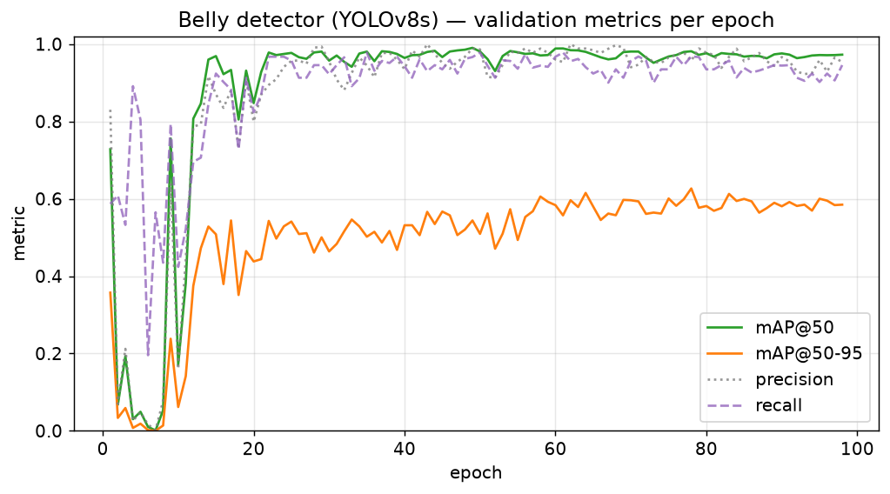
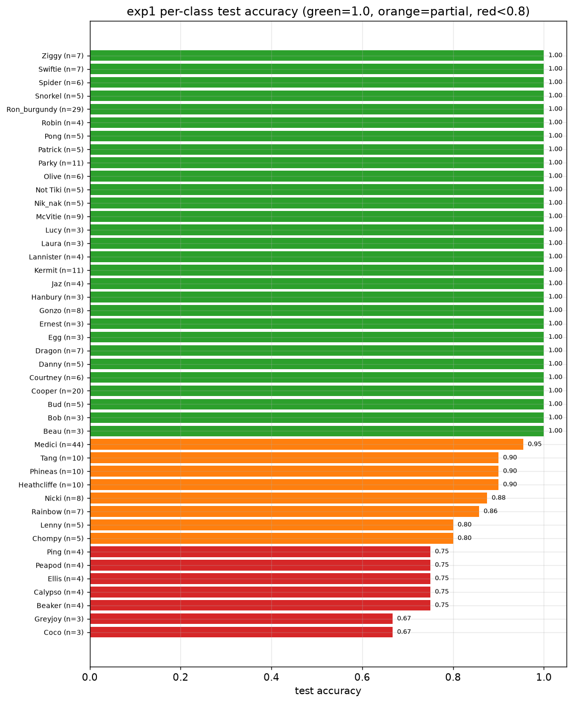
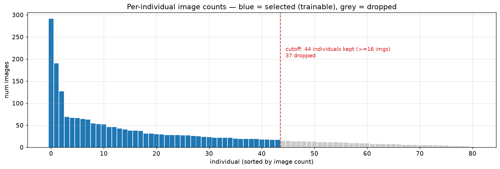

# 企鹅个体识别（Penguin Individual Re-Identification）

[English](README.md) | **中文**

给定一张**洪堡企鹅（Humboldt penguin）**照片，识别它是**哪一只**具体的企鹅（个体身份，非物种）。最终目标：游客拍一张照片，即可查出对应企鹅个体，以及它的名字、特征、习性。本项目所有个体均为同一种群的洪堡企鹅。

项目正从**分类 baseline** 演进为 **embedding 检索 + RAG** 系统——把每张照片转成向量，在向量数据库中匹配，再用 LLM 生成有事实依据（grounded）的企鹅介绍。

---

## 目录
- [1. 数据集](#1-数据集)
- [2. 已完成的实验](#2-已完成的实验)
- [3. 实验数据记录图](#3-实验数据记录图)
- [4. 关键结论](#4-关键结论)
- [5. 旗舰方案：Embedding 检索 + RAG](#5-旗舰方案embedding-检索--rag)
- [6. 目录结构](#6-目录结构)
- [7. 复现方式](#7-复现方式)

---

## 1. 数据集

- 原始数据 `penguins_data/`：共 **82 只**企鹅，每只照片数从 1 到 291 张不等，**长尾严重不均衡**。
- 按「照片数 ≥ 16 张」筛选出 **44 只**作为可训练个体（`penguin_image_count_summary.csv` 中 `selected=True`），其余 37 只（≤15 张）样本太少，暂不参与训练。
- 已按个体切分为 train / val / test：`penguins_dataset_split/`。
- 肚子裁剪版本数据（由肚子检测器裁出）：`penguins_dataset_split_belly_by_yoloV8/`。

> 即便在筛选后的 44 类内部，样本量仍从 291（Medici）到约 16，最大/最小差约 18 倍，是后续所有难点的根源。见 [图 05](#3-实验数据记录图)。

## 2. 已完成的实验

| 实验 | 输入 | 模型 | 训练轮次 | best val acc | **test acc** |
|---|---|---|---|---|---|
| **exp1 baseline** | 全身照 | ResNet18（迁移学习） | 29（早停，上限30） | 0.907 | **0.950** |
| **exp2 belly** | 肚子裁剪图 | ResNet18（迁移学习） | 39（早停，上限50） | 0.867 | 0.866 |
| **belly detector** | 全身照 | YOLOv8s 检测 | 98 | mAP@50 ≈ 0.98 | mAP@50-95 ≈ 0.60 |

三者共用流程：
- `torchvision.datasets.ImageFolder` 加载
- 迁移学习（ImageNet 预训练 ResNet18）
- 类别不均衡处理：`WeightedRandomSampler` + 类别加权 `CrossEntropyLoss`
- 按验证集准确率保存最优 checkpoint，最后在 test 上评估并导出预测 CSV

**exp1（全身照）**——test accuracy **0.950**，best val 0.907（第 21 轮）。每类表现见 [图 04](#3-实验数据记录图)：样本多的个体（Cooper n=20、Ron_burgundy n=29、Medici n=44）几乎全对；出错集中在 test 只有 3~5 张样本的小类。

**exp2（肚子裁剪）**——test accuracy **0.866**，明显**低于**全身照的 0.950。其 val loss 始终高于 exp1（[图 01](#3-实验数据记录图) 右），泛化更差。

**肚子检测器（YOLOv8s）**——训练 98 轮，验证 **mAP@50 ≈ 0.98、mAP@50-95 ≈ 0.60**，precision/recall 约 0.95（[图 03](#3-实验数据记录图)）。权重：`runs/detect/runs/belly_detector/exp1/weights/best.pt`。检测本身够好，但裁剪会**丢弃脸/胸带/体型等身份信息**，且检测误差会传播给下游分类器——这解释了实验二为何更差。

## 3. 实验数据记录图

所有图由 `plot_experiments.py` 从各 run 的日志重新生成，输出到 `figures/`。

**图 01 — 分类器训练曲线（全身 vs 肚子）**


**图 02 — 最终 44 类 test 准确率对比**


**图 03 — 肚子检测器（YOLOv8s）验证指标**


**图 04 — 实验一每类 test 准确率（按准确率排序，含每类支持样本数 n）**


**图 05 — 数据集每个个体的照片数分布（蓝=入选可训练，灰=样本太少被弃）**


## 4. 关键结论

1. **全身照 > 肚子裁剪（0.950 vs 0.866）。** 身份信号不只在肚子——脸部花纹、胸前黑带、体型比例都是线索。裁得太狠会丢信息，检测误差还会传播噪声。
2. **训练/采集标准 = 全身正面照。** 不再强求肚子清晰完整。
3. **只用正面。** 企鹅背部大面积均匀深色，个体间几乎无差别，正反混训会拉高类内方差、引入跨类混淆。线上系统对「非正面」照片应提示重拍，而不是硬给身份。
4. **瓶颈是数据，不是模型。** 错误几乎全部落在样本 ≤5 张的小类上；样本多的个体已接近满分。提升上限的关键是**补数据 + 更强的少样本/度量学习方法**，而非单纯换更大的 backbone。

## 5. 旗舰方案：Embedding 检索 + RAG

核心方向：把分类器升级为**多模态检索 + 检索增强生成（RAG）**应用。

### 流水线
```
游客照片
   │
   ▼
[检测 + 正面过滤]  ── 非正面 / 非企鹅 ──▶ “请重拍”
   │
   ▼
[图像 embedding 模型]  （ArcFace 训练的 backbone，或 CLIP / DINOv2）
   │  照片 → 向量
   ▼
[向量数据库：企鹅底库]  （FAISS / Qdrant / Milvus / pgvector）
   │  ANN 检索 top-k 已注册向量
   ▼
[匹配 + 开放集阈值]  ── 距离过大 ──▶ “未知个体”
   │  身份 = Cooper
   ▼
[知识检索 — RAG]
   ├─ Cooper 的结构化档案（名字、年龄、性别、脚环颜色、性格、习性、饲养员备注）
   └─ 企鹅通用知识片段（物种生物学、种群、保育）
   │
   ▼
[LLM 基于检索文档生成]  → 名字、特征、习性、回答游客问题
```

### RAG 的两种角色（同时使用）
1. **档案 grounded 生成**——识别出身份后，取该个体的档案文档，让 LLM 生成自然语言介绍。grounding 能防止模型**对一只真实、有名字的动物编造事实**——这是这里用 RAG 的一个具体、站得住脚的理由。
2. **开放域问答**——一个知识库（企鹅生物学、种群、饲养、保育）切块 + 向量化；游客自由提问时检索相关片段 → 有引用来源的 grounded 回答。

### 可选的 Agent 层（额外加分）
一个 LLM agent 编排工具：`identify_penguin(image)`、`get_profile(name)`、`search_knowledge(query)`——由模型决定调用哪个。这在一个系统里同时展示 **AI agent + 多模态检索 + RAG**。

### 产品形态：可对话的洪堡企鹅专家
面向用户的外壳是一个聊天窗口。用户扫码 / 打开 App 进入时，机器人主动打招呼：

> 🐧 你好！我是这里的**洪堡企鹅专家**。拍一张企鹅的**正面全身照**发给我，我就能告诉你它是哪一只，以及它的名字、生日、性格和小故事～ 关于企鹅的任何问题也都可以问我！

- **人设** = agent 的 system prompt（亲切、简洁，像热情的饲养员）。
- **照片 → 身份**：收到企鹅照片触发 `identify_penguin`，再用 `get_profile` 介绍这一只。
- **问题 → 知识**：通用企鹅问题触发 `search_knowledge`。
- **会话记忆**：把本次识别出的企鹅存进会话状态，后续追问（"它几岁？"）无需重新上传照片。
- **不确定时优雅处理**：置信度低 / 非正面照时，请用户重拍清晰正面照，而不是硬猜。
- **事实 grounding**：关于某只企鹅的事实只来自 `get_profile`，字段缺失就如实说没有，绝不编造——这是防幻觉的核心保证。

### 建议技术栈
- **图像 embedding**：B1 训练的 ArcFace backbone，与开箱即用的 **DINOv2 / CLIP**（免训练、细粒度特征强）做对照。
- **向量数据库**：FAISS（简单/本地）→ **Qdrant**（更有生产感）做 demo。
- **文本 embedding**：`bge` / `e5` 或 API embedding，用于知识库。
- **LLM**：Claude（如 `claude-opus-4-8`）走 API，做 grounded 生成 + 引用。
- **服务**：FastAPI 后端 + Streamlit/Gradio demo 前端。
- **评测**（AI 应用岗最看重的）：检索命中率（top-k）、回答 **忠实度/grounded 程度**、开放集拒识精度。

### 为什么这是个有含金量的求职项目
它把细粒度 CV、**度量学习**、**向量数据库**、**多模态 RAG**、**带防幻觉护栏的 grounded LLM 生成**、**RAG 评测**组合在一起——正是 AI 应用工程师的完整工具箱，且跑在一份真实、非玩具的数据集上。

## 6. 目录结构

```text
pgs/
├─ README.md / README.zh-CN.md       # 中英双语文档
├─ plot_experiments.py               # 由日志重新生成 figures/
├─ figures/                          # 实验记录图（PNG）
├─ penguin_image_count_summary.csv   # 82 只个体照片数与是否入选
├─ make_doc.py                       # 生成《企鹅照片收集清单》.docx
│
├─ train_experiment1.py              # 分类训练脚本（exp1/exp2）
├─ eval_checkpoint.py                # checkpoint 评估
├─ crop_penguin_belly_yolo.py        # 用 YOLO 裁肚子
├─ prepare_belly_yolo_dataset.py     # 准备肚子检测数据集
├─ train_belly_detector.py           # 训练肚子检测器
├─ annotate_belly.py                 # 肚子标注工具
│
├─ penguins_data/                    # 原始数据
├─ penguins_dataset_split/           # 全身照 train/val/test（exp1）
├─ penguins_dataset_split_belly_by_yoloV8/  # 肚子裁剪 train/val/test（exp2）
│
└─ runs/
   ├─ exp1_baseline/                 # 全身照分类结果
   ├─ exp2_belly_resnet18/           # 肚子裁剪分类结果
   └─ detect/…/belly_detector/exp1/  # 肚子检测器结果
```

## 7. 复现方式

安装依赖（RTX 4060 用 CUDA 版 PyTorch）：
```powershell
pip install torch torchvision --index-url https://download.pytorch.org/whl/cu121
pip install numpy pillow ultralytics matplotlib python-docx
```

训练分类器：
```powershell
# 实验一：全身照
python train_experiment1.py --data-dir penguins_dataset_split --epochs 30 --batch-size 32
# 实验二：肚子裁剪
python train_experiment1.py --data-dir penguins_dataset_split_belly_by_yoloV8 --epochs 50 --batch-size 32
```

重新生成实验图 / 照片清单：
```powershell
python plot_experiments.py
python make_doc.py
```
